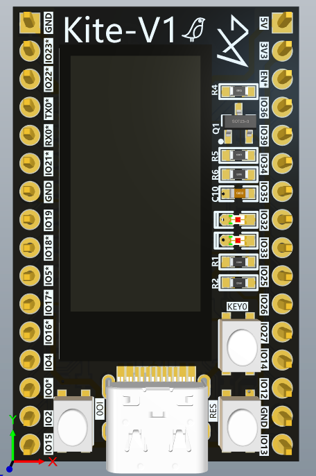
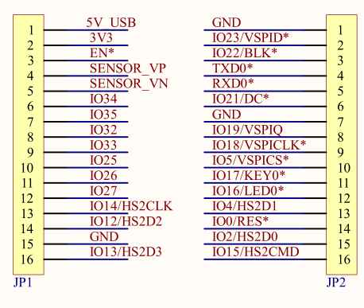
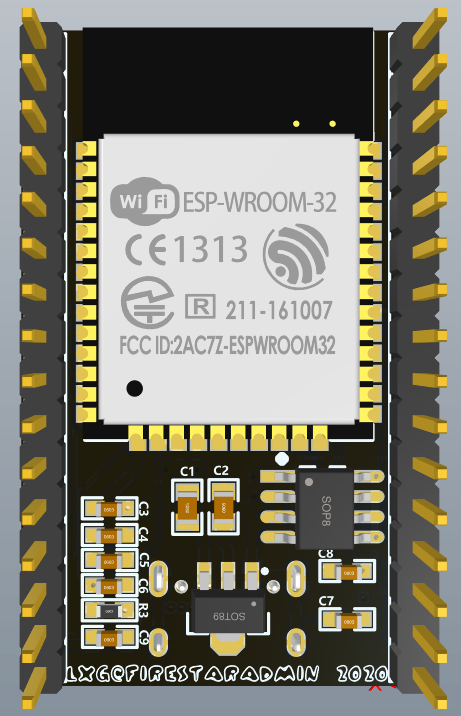
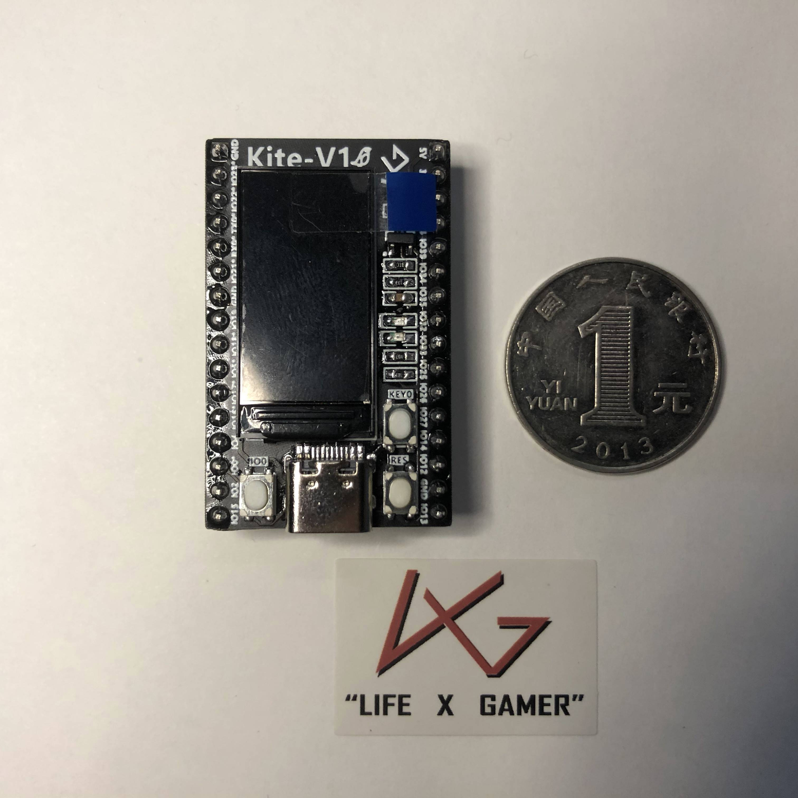
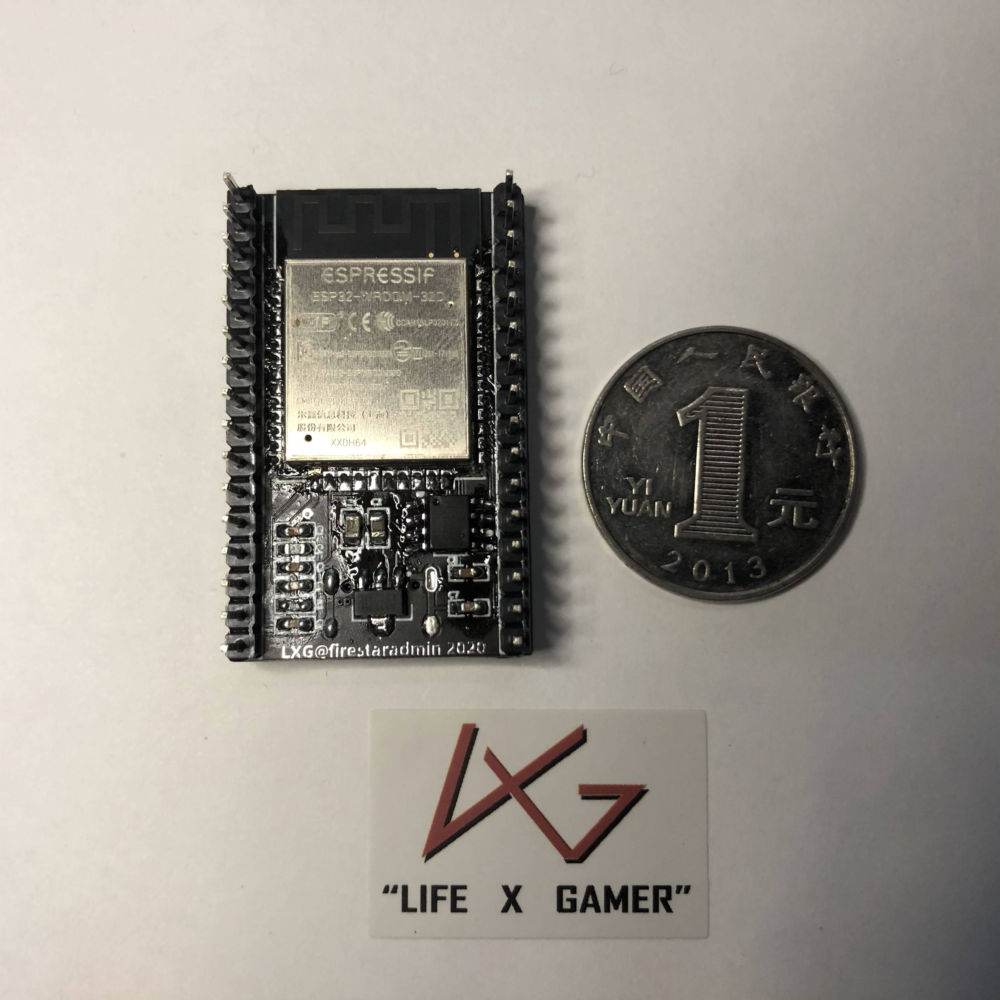

项目以开源至GIthub:[点我传送](https://github.com/firestaradmin/Kite_V1)

# Kite_V1.0[ESP32-WROOM-32D]

## 一、简介

此开发板是以ESP32-WROOM-32D模组为主体的开发板。

### 1| 资源介绍

**ESP32-D0WD 内置双核低功耗 Xtensa ® 32-bit LX6 MCU。片上存储包括：**

- 448 KB 的 ROM，用于程序启动和内核功能调用
- 520 KB 片上 SRAM  用于数据和指令存储 
- 4/8/16MB QSPI-FLASH

> ESP32-WROOM-32D 和 ESP32-WROOM-32U 集成了4/8/16MB QSPI-FLASH，连接 ESP32 的管脚 GPIO6，GPIO7，GPIO8，GPIO9，GPIO10 和 GPIO11。这六个管脚不建议用于其他功能。

---

**Kite_V1.0添加了以下外设资源：**

- USB转串口
- 0.96inch-IPS-SPI-屏幕
- KEY*3 [RES、IO0、USERKEY0]
- LED*2 [POWER、USERLED0]
- etc..

### 2| 功能介绍

- KiteV1.0 具备240MHz双核CPU，同时支持 WIFI&BT 的通信。可以很方便的开发物联网产品。

- 板载0.96inch的ips屏幕，分辨率 80*160. 
- 此板为最小系统板，后续会发布一些扩展板，底板，方便更多的应用开发，如：蓝牙音箱

### 3| 引脚引出

## 二、外观

### 渲染:

### 实物:

